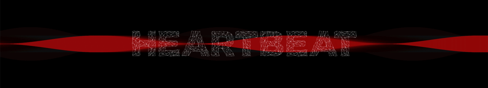
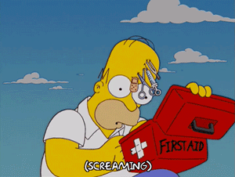

**HEARTBEAT** is a university project developed and realized with p5.js library in Creative Coding class, taught by Mauri Michele and Elli Tommaso at Politecnico di Milano.

The main purpose of our interactive page is to show all the passages of the first aid in short time and how difficult it can be without panicking.

## Index

- [About first aid](#about-first-aid)
- [Project concept](#project-concept)
- [Development](#development)
- [Team](#team)

# About first aid

To provide a correct first aid to a wounded person or a victim of an accident, there are specific steps to follow.

It's crucial for you and the person involved to **not improvise**. It's also important to not forget that unexpected events can happen though. So if you want to provide first aid you have to **keep calm and not get panicked**.

You also have to check that the person really wants your help. So if he/she believes that they aren't in need of urgent rescue, **don't force their hands**.

Once you make sure that everything mentioned before is okay, the following procedure expects that **every single step has to be done in this precise order**, otherwise you can damage the person. You have to:

+ first press down on the breastbone to start the assistance;
+ then alternate 30 of this with less intensity at a rate of 100 to 120 a minute and 2 rescue breaths;
+ continue with cycles of 30 chest compressions and 2 rescue breaths until they begin to recover or emergency help arrives.

If everything is correct you’ll have provided the correct assistance. On the contrary, you should probably better think two or three times before trying doing first aid and making things even worse!





# Project concept

The idea was born wondering how many times it has happened that you are in danger and nobody pay attention to you. And what if the only person who stops to give you help is not so good and make things even worse?

We decided that it could be really interesting for a user to experience the thrill of having a person's life on their hands. The benefit from this page is that you are in a realistic situation but you don't worsen the physical condition of a true person.  Moreover, you'll learn some new information about first aid and will see that it is not worth playing the hero if you don't have enough skills.

**It's a short experience with a deep meaning.**
Our aim was to make a concrete example of **how stressful and difficult can be following every steps to save a situation in which somebody is in physical danger**. Besides, we found out that one in particular — the cardiopulmonary resuscitation — should be held at the same rhythm of the low frequencies of "Stayin' Alive" by Bee Gees. Therefore, to make the website more interesting and quite endearing, we implemented it.


## Reference

[One Last Beat](http://onelastbeat.com) was our main reference for the storyline and concatenation of events. However, we thought it would be proper to avoid macabre and way too funny stuff in our page.


# Development

## Rendering

We used 3D models to make human organs as realistic as we can. We first made some render of them. But to not make the page way too heavy, we thought it would be better to put in simple PNGs. So we carried out cropping them in Photoshop instead of using WEBGL.


## Interactions
#### Libraries
We used:
+ p5.js
+ p5.dom.js
+ p5.sound.js

#### Breastbone
``` python
{function draw() {
  background(0);
  imageMode(CENTER);
  image(costole, windowWidth/2, windowHeight/2, w, h);
  imageRatio = costole.height/costole.width;
}
function keyPressed() {
  if(keyIsDown(82) && keyIsDown(71) && keyIsDown(67)&& keyIsDown(73)&& keyIsDown(72) && keyIsDown(71) && a == 0) {
    setInterval(scompari, 500)
    a = 1;
  }
}
function scompari() {
  if (a == 1) {
    a = 2;
    tint(255, 200);
    setInterval(scompari2, 500);
  }
}
function scompari2() {
  if (a == 2) {
    a = 3;
    tint(255, 100);
    setInterval(scompari3, 500);
  }
}

function scompari3() {
  if (a == 3) {
    a = 4;
    tint(255, 50);
    setInterval(scompari4, 500);
  }
}
function scompari4() {
if (a == 4) {
tint(255, 0);
setInterval(appari, 250)
}
}}
```
#### Heart
``` python
{function keyPressed() {
  if (keyIsDown(83) && keyIsDown(68) && keyIsDown(74) && keyIsDown(75) && (passo == 0 || passo == 2 || passo == 4)) {

    if (!song.isPlaying() || song.isPaused()) {
      song.play();
    }
    w1 = 330;
    h1 = 330;
    caso--;
    alfa = 40;
    clearTimeout(timer);
    timer = setTimeout(function() {
      lose2();
    }, 3000);
    var now = Date.now();
    if (step1 == 15) {
      if (passo == 4) {
        winStep3();
      } else {
        winStep1();
      }
      clearTimeout(timer);
    }
    else if ((now - start > 900 || now - start < 200 || sommaTot > 1500) && start != -1) {
      lose();
      message = 'You are not keeping up'
    } else {
//stai andando bene
      if (step1 > 15) {
        message = 'Keep it up, you are doing well!'
      }
      if (start != -1) {
        sommaTot = sommaTot + (now - start - 600);
      }
      step1++;
      // check++;
      // console.log('check', check);
    }
    start = now;
  }
}}
```
#### Lungs
``` python
{var vol = mic.getLevel() * 10;
var threshold_min = 0.3;
message = 'Hold N and blow to ...';
amplitude = 0;
alfa = 255;
if (vol > threshold_min) {
  fill(255, 255, 255, 60);
  rect(windowWidth/2-160, windowHeight/5*2, vol * 28, 50);
}
stroke(255);
line(windowWidth/2-160, windowHeight/5*2, windowWidth/2-160, windowHeight/5*2+50);
line(windowWidth/2+130, windowHeight/5*2, windowWidth/2+130, windowHeight/5*2+50);

if (keyIsDown(78) && (passoSoffio == 0 || passoSoffio == 4)) {
  clearTimeout(timer2);
  message = '';
  timer2 = setTimeout(function() {
    lose2();
  }, 10000);
  passoSoffio++;
}
if ((passoSoffio == 1 || passoSoffio == 5) && vol > threshold_min) {
  clearTimeout(timer2);
  start = Date.now();
  passoSoffio++;
} else if ((passoSoffio == 2 || passoSoffio == 6) && (Date.now() - start) > 1000) {
  passoSoffio++;

  if (vol > threshold_min) {

    if (passoSoffio == 7) {
      winStep2();
    } else {
      message2 = 'Release and click again to blow another time';
    }
  } else {
    lose2();
    //passoSoffio --;
  }
} else if (passoSoffio == 3 && !keyIsDown(78)) {
  passoSoffio++;
}
} else {
image(heart, windowWidth / 2, windowHeight / 2, w1, h1);
}}
```
## Difficulties encountered

The difficulties encountered during the development of this project were amplified by the fact that we wanted not also a clean look for the page from outside but also from the inside. As fo that, we tried to optimize the code as much as we could, by trying to avoid useless repetitions and so on.

In particular, the struggles were:
  + Making proper and functional use of the microphone since its implementation is not that easy and smooth;
  + Dealing with different interactions and make them work together and not interfere with each other during the different instances of the website.

# Team

HEARTBEAT is a interactive page developed by:
+ Andrini Valerio
+ Desogus Luca
+ Varesano Greta

**Hope you'll enjoy the experience!**
